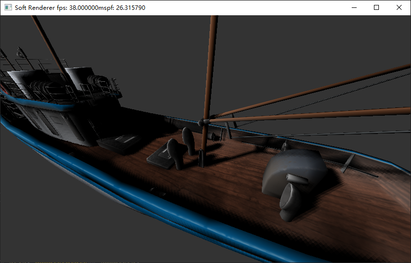
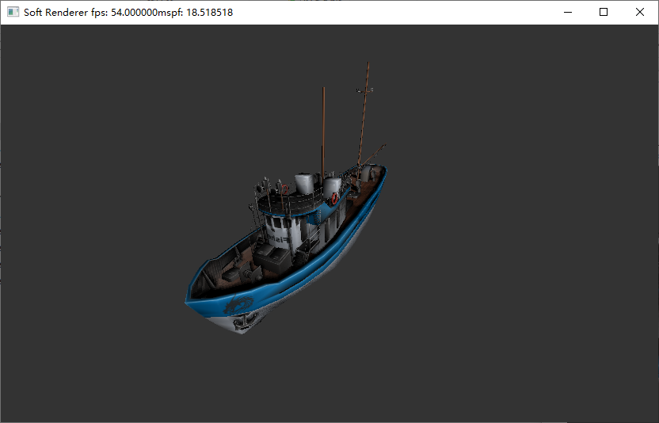

# Soft Renderer:

## Results:

## Features

* Blinn-Phong 
* Shadow map
* Normal mapping
* Depth test
* Back face culling
* Homogeneous clipping
* Perspective correct interpolation

## TODO

* Multiple render targets
* Blend
* Stencil test
* MSAA
* Mipmap